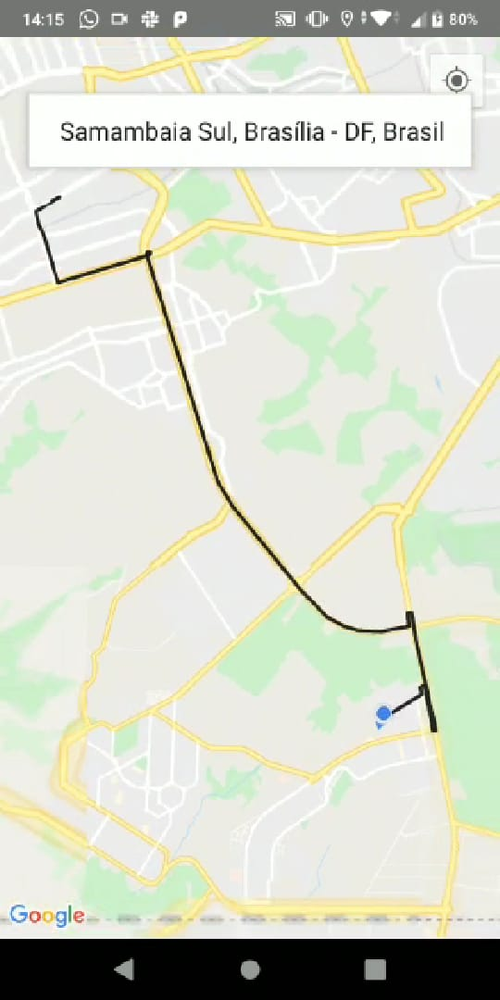
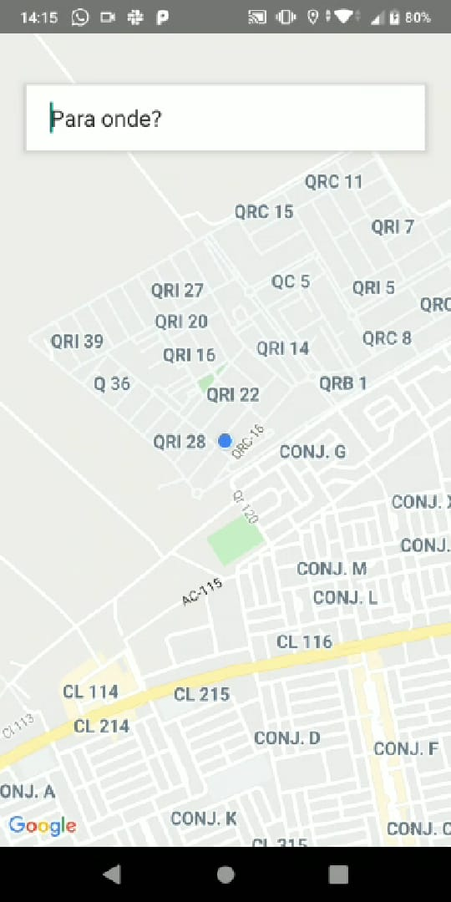

# Uber UI Clone

> An React native application inspired in Uber app.

 

***MOBILE***

  

  

## Table of Contents

- [Installation](#installation)
- [Tecnologies](#tecnologies)
- [Contributing](#contributing)
- [License](#license)

## Installation

1. Clone this repo to your local machine using `git clone https://github.com/caio546/uber-interface-clone`.
2. Run `yarn install` inside the directory.
3. Run `yarn start`.
4. Run `yarn ios` or `yarn android` to start the application in an emulator or in a physical device.
---
## Tecnologies
This applications was built with the following technologies.
- [React Native](https://facebook.github.io/react-native/)

## Contributing

### Step 1

- **Option 1**
    - 🍴 Fork this repo!

- **Option 2**
    - 👯 Clone this repo to your local machine.

### Step 2

- **Make your changes!** 🔨🔨🔨

### Step 3

- 🔃 Create a new pull request with detailed information.
---
## License

